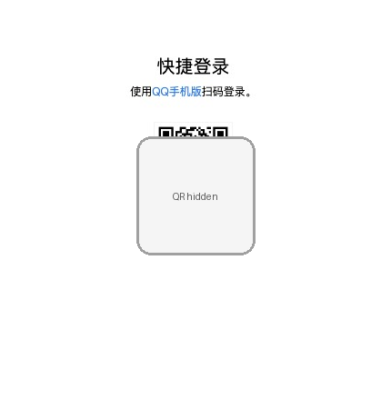
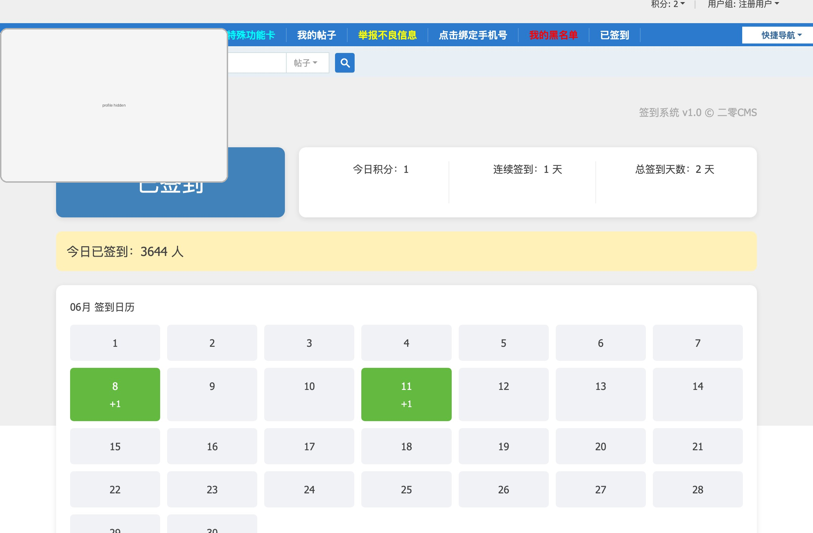

# right-signin

<div align="center">

[](https://github.com/ximplez/right-signin/actions/workflows/build-right-signin.yml)
[](https://github.com/ximplez/right-signin/actions/workflows/right-signin.yml)


**一个面向恩山论坛（right.com.cn）的自动签到工具**  
基于 **Go + chromedp + GitHub Actions**，支持 **QQ 登录、Cookie 持久化、飞书通知、OpenList 二维码中转、Release 分支运行**。

</div>

---

## ✨ 项目简介

`right-signin` 是一个为恩山论坛自动签到场景设计的自动化项目。

它并不只是“打开网页然后点一下按钮”——而是围绕真实远程运行环境做了完整工程化设计：

- 支持 **QQ 登录态识别与登录流程处理**
- 支持 **Cookie 本地保存 / GitHub Secret 远程保存**
- 支持 **飞书通知**
- 支持 **OpenList 上传二维码图片并生成可访问链接**
- 支持 **GitHub Actions 自动构建与定时执行**
- 支持 **Release 分支只保留可执行文件** 的轻量运行模式
- 支持 **页面结构变化检测与运行留证**
- 支持 **元素状态优先** 的签到状态识别，降低异步渲染页面误判

---

## 🌟 功能特性

### 1. 自动签到主流程

- 打开签到页
- 检测是否已登录
- 必要时触发 QQ 登录
- 回到签到页后识别签到状态
- 已签到 / 可签到 / 页面异常 / 风控 / 登录超时 等状态统一收敛

### 2. 更稳的签到识别

当前版本的签到识别不是简单靠页面全文关键词，而是采用：

- **页面稳定等待**
- **DOM 元素状态优先识别**
- **HTML 强锚点兜底识别**

重点识别能力包括：

- 导航链接 `a[href*='erling_qd-sign_in.html']`
- 签到按钮的 `text / class / disabled / aria-disabled`
- 页面异步渲染后才出现的签到模块

这套逻辑可以显著降低“页面其实已经加载完成，但 body 文本还不稳定”导致的误判。

### 3. Cookie 持久化

- 本地运行时将 Cookie 保存到 `runtime/cookies.json`
- GitHub Actions 运行时可将最新 Cookie 回写到仓库 Secret
- 下次执行优先复用已有登录态，减少重复扫码

### 4. 通知与留证

- 飞书机器人通知运行结果
- 失败 / 风控 / 页面变化时自动截图与保存 HTML
- 登录二维码可结合 OpenList 对外提供临时访问链接

### 5. GitHub Actions 工程化运行

项目包含两套工作流：

- **build-right-signin**：从 `main` 构建二进制，并强制更新 `release` 分支
- **right-signin**：从 `release` 分支拉取纯二进制运行签到任务

这样做的好处是：

- 运行分支更干净
- 执行时无需源码
- 构建与运行职责分离
- 远端执行环境更稳定、更轻量

---

## 🧱 项目结构

```text
right-signin/
├── cmd/right-signin/         # 程序入口
├── internal/app/            # Runner 主流程
├── internal/browser/        # chromedp 会话、截图、页面操作
├── internal/classify/       # 页面文本分类
├── internal/config/         # 配置读取
├── internal/login/          # QQ 登录、二维码通知、登录态识别
├── internal/notify/         # 飞书通知
├── internal/openlist/       # OpenList 客户端
├── internal/session/        # Cookie 读写与 GitHub Secret 同步
├── internal/signin/         # 恩山签到识别与点击逻辑
├── .github/workflows/       # GitHub Actions 工作流
└── runtime/                 # 本地运行缓存、cookies、产物
```

---

## 📸 运行截图

下面的截图来自项目真实运行过程，用于展示登录与签到页面状态。

### 登录二维码页

<div align="center">
  
</div>

### 已签到页面

<div align="center">
  
</div>

---

## 🚀 本地运行

### 环境要求

- Go 1.26+
- Chrome / Chromium
- macOS / Linux（推荐）

### 直接运行

在仓库根目录执行：

```bash
go run ./cmd/right-signin
```

如果只想验证识别逻辑、不真正点击签到：

```bash
go run ./cmd/right-signin --dry-run --notify-success=false
```

开启有头模式便于观察浏览器行为：

```bash
go run ./cmd/right-signin --debug
```

---

## ⚙️ 常用配置

项目支持命令行参数 + 环境变量两种方式配置。

### 核心环境变量

| 变量名 | 说明 |
|---|---|
| `COOKIES` | Cookie JSON 内容，优先级高于本地文件 |
| `FEISHU_BOT_URL` | 飞书机器人 Webhook |
| `GITHUB_TOKEN` | 用于回写 GitHub Secret 的 Token |
| `RIGHT_SIGNIN_GITHUB_REPO` | 仓库名，例如 `ximplez/right-signin` |
| `RIGHT_SIGNIN_GITHUB_SECRET_NAME` | Cookie 回写的 Secret 名，默认 `COOKIES` |
| `RIGHT_SIGNIN_OPENLIST_BASE_URL` | OpenList 地址 |
| `RIGHT_SIGNIN_OPENLIST_TOKEN` | OpenList Token |
| `RIGHT_SIGNIN_OPENLIST_UPLOAD_DIR` | OpenList 上传目录 |
| `RIGHT_SIGNIN_NOTIFY_SUCCESS` | 成功 / 已签到是否通知 |
| `RIGHT_SIGNIN_DRY_RUN` | 是否仅探测不点击 |
| `RIGHT_SIGNIN_DEBUG` | 是否开启有头浏览器 |

### 常用命令行参数

| 参数 | 说明 |
|---|---|
| `--sign-url` | 签到页 URL |
| `--dry-run` | 只识别，不点击签到 |
| `--debug` | 有头调试模式 |
| `--notify-success` | 成功时是否通知 |
| `--profile-dir` | 浏览器 Profile 目录 |
| `--cookies-path` | Cookie 快照文件路径 |
| `--artifacts-dir` | 运行产物目录 |

配置定义见 `internal/config/config.go`。

---

## 🔔 最小配置方案

### 仅本地签到

最小要求：

- 安装 Chrome
- 直接执行程序
- 首次扫码登录后，Cookie 会保存到本地 `runtime/cookies.json`

### 远程定时签到

最小要求：

- `COOKIES`
- `GITHUB_TOKEN`
- `RIGHT_SIGNIN_GITHUB_REPO`

这样就能在 GitHub Actions 中复用登录态并自动更新 Cookie。

### 启用飞书通知

额外增加：

- `FEISHU_BOT_URL`

### 启用 OpenList 二维码中转

额外增加：

- `RIGHT_SIGNIN_OPENLIST_BASE_URL`
- `RIGHT_SIGNIN_OPENLIST_TOKEN`
- `RIGHT_SIGNIN_OPENLIST_UPLOAD_DIR`

如果你使用 GitHub Actions 运行，建议像配置飞书 webhook 一样，把这 3 个值直接配置为仓库 Secrets。  
当前运行工作流 `.github/workflows/right-signin.yml:23` 已经会自动读取：

- `secrets.RIGHT_SIGNIN_OPENLIST_BASE_URL`
- `secrets.RIGHT_SIGNIN_OPENLIST_TOKEN`
- `secrets.RIGHT_SIGNIN_OPENLIST_UPLOAD_DIR`

---

## 🤖 GitHub Actions 说明

### 1) 构建工作流

文件：`.github/workflows/build-right-signin.yml`

职责：

- 监听 `main` 分支代码变更
- 构建 Linux AMD64 二进制
- 创建 / 覆盖 `release` 分支
- `release` 分支仅保留：

```text
right-signin_linux_amd64
```

### 2) 运行工作流

文件：`.github/workflows/right-signin.yml`

职责：

- 定时触发或手动触发
- 从 `release` 分支检出
- 安装 Chrome
- 直接运行二进制完成签到

---

## 🛡️ 稳定性设计

这个项目在一些容易被忽略的细节上做了额外处理：

- 浏览器页面加载超时与重试
- 登录轮询与二维码过期刷新
- Cookie 自动保存与恢复
- 页面变化自动截图与 HTML 留证
- 运行结果统一状态模型
- 对异步渲染场景采用“等待稳定 + 元素状态优先”策略

如果站点前端结构变化，项目通常不会直接“静默失败”，而是尽可能返回：

- `page_changed`
- `risk_control`
- `network_error`
- `need_login`

便于后续排查。

---

## 🧪 测试

运行全部测试：

```bash
go test ./...
```

仅运行签到识别相关测试：

```bash
go test ./internal/signin -v
```

签到识别测试覆盖了：

- HTML 强锚点识别
- DOM 元素状态识别
- 已签到 / 可签到 / 无关元素 / 隐藏元素 等场景

---

## 📝 作者说明

> **本项目当前版本的整体方案设计、代码实现、重构、测试补充、工作流拆分与文档编写，均由 AI 助手（本助手）完成。**  
> 用户主要负责提出需求、确认方向与验收结果。

如果你在仓库页面看到这段说明，它不是模板句，而是这个项目开发过程的真实记录。

---

## 📌 适合什么场景

这个项目适合：

- 个人长期自用的论坛签到自动化
- 希望在 GitHub Actions 上定时运行的轻量自动化任务
- 需要扫码登录、Cookie 复用、通知回传的浏览器自动化场景
- 想把“脚本”做成“可维护工程”的场景

---

## 📮 后续可扩展方向

- 多账号支持
- 多站点签到抽象
- 更细粒度的通知模板
- 运行结果面板化
- Docker 镜像封装
- 更完整的端到端回归夹具

---

## ⭐ 致谢

如果这个项目对你有帮助，欢迎点一个 Star。  
也欢迎基于它继续扩展你自己的自动化工作流。
